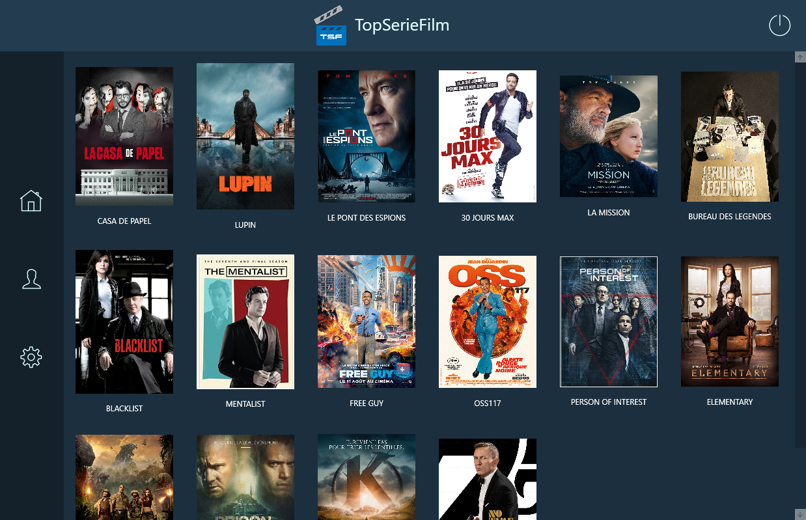

<h1 align="center"> TopSerieFilm 👋</h1>

> TSF est une application WPF permettant à ses utilisateurs de stocker et regrouper une multitude de films et séries.

### 🏠 [Homepage](https://github.com/B3njaminV/wpf-tsf-app)



## 📍 Prérequis

- C# .NET Framework

##  ‍💻 Installation
```sh
TSF_InstallerSetup/TSF_InstallerSetup.msi
```

## ✏️ Auteur

👤 **VALLEIX Benjamin**

* Github: [@B3njaminV](https://github.com/B3njaminV)
* LinkedIn: [@Benjamin VALLEIX](https://www.linkedin.com/in/benjamin-valleix/)


## 📝 License

Copyright © 2020


## 🛠 Languages & Tools

<p> 
    <a href="https://docs.microsoft.com/en-us/dotnet/csharp/" target="_blank"> 
         
    </a> 
	<a href="https://tortoisesvn.net/" target="_blank"> 
         
    </a> 
</p>
